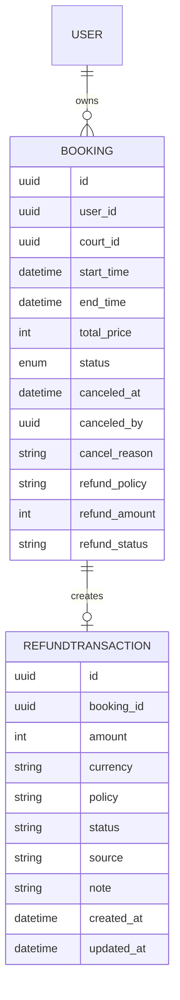
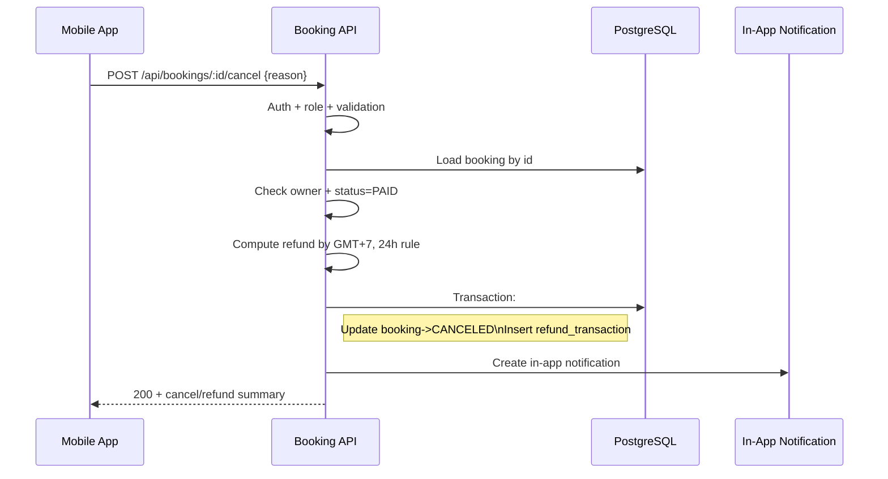

# Technical Design Document: Booking Cancellation (Phase 1 - Internal Refund Handling)

## 1. Overview

This feature allows authenticated customers to cancel their own paid bookings. The system applies cancellation/refund policy based on rental start time in Vietnam timezone (GMT+7), updates booking status to `CANCELED`, persists refund information for manual/internal processing, and sends in-app notification.

Scope in this phase:
- New cancel endpoint: `POST /api/bookings/:bookingId/cancel`
- Cancellation policy evaluation and refund amount calculation
- Persist internal/manual refund status (no payment-gateway integration)
- In-app notification for cancellation result

Out of scope in this phase:
- Real payment-gateway refund API integration
- Automated reconciliation with external payment providers

## 2. Requirements

### 2.1 Functional Requirements

- Only authenticated users with role `CUSTOMER` can call cancel booking.
- A customer can cancel only their own booking.
- Booking is cancellable only when current status is `PAID`.
- Request must include `reason` for cancellation.
- Cancellation rule (GMT+7):
  - Cancel time <= `startTime - 24h` => `refundAmount = 70% * totalPrice`
  - Cancel time > `startTime - 24h` => `refundAmount = 0`
- After successful cancellation:
  - Booking status changes to `CANCELED`
  - Cancellation metadata is persisted
  - Refund record/status is persisted as internal/manual processing
  - In-app notification is created

### 2.2 Non-Functional Requirements

- p95 latency for cancel endpoint <= 300 ms (no external gateway call).
- Security: enforce authentication, ownership checks, and input validation.
- Reliability: cancellation and refund metadata write must be atomic (single DB transaction).
- Observability: structured logs, audit events, and metrics for cancellation outcomes.
- Idempotency behavior: repeated cancel on already canceled booking returns deterministic business error.

## 3. Technical Design

### 3.1. Data Model Changes

Add cancellation/refund tracking fields to `Booking` and create `RefundTransaction` table for internal/manual lifecycle.

Proposed schema updates:
- `Booking`:
  - `canceledAt DateTime?`
  - `canceledBy String?` (FK -> `User.id`)
  - `cancelReason String?`
  - `refundPolicy String?` (`REFUND_70` | `NO_REFUND`)
  - `refundAmount Int?`
  - `refundStatus String?` (`PENDING_MANUAL` | `COMPLETED_MANUAL` | `REJECTED_MANUAL`)
- New `RefundTransaction`:
  - `id`
  - `bookingId` (FK -> `Booking.id`)
  - `amount`
  - `currency` (default `VND`)
  - `policy` (`REFUND_70` | `NO_REFUND`)
  - `status` (`PENDING_MANUAL` | `COMPLETED_MANUAL` | `REJECTED_MANUAL`)
  - `source` (`BOOKING_CANCEL`)
  - `note`
  - `createdAt`, `updatedAt`

Suggested indexes:
- `Booking(status, startTime)`
- `Booking(userId, status, createdAt)`
- `RefundTransaction(status, createdAt)`
- `RefundTransaction(bookingId)` unique if 1 cancellation refund record per booking

ERD (Phase 1):



### 3.2. API Changes

**POST `/api/bookings/:bookingId/cancel`** (NEW)

Middleware stack:
- `authenticate` -> `requireRole(CUSTOMER)` -> `validate(cancelBooking)` -> controller -> service -> repository (transaction)

Request params:
- `bookingId` (UUID)

Request JSON:

```json
{
  "reason": "Bận việc đột xuất, không thể đến sân"
}
```

Validation:
- `reason`: required, trimmed, 10-500 chars

Success response (`200`):

```json
{
  "bookingId": "uuid",
  "status": "CANCELED",
  "canceledAt": "2026-02-02T10:00:00.000Z",
  "refundPolicy": "REFUND_70",
  "refundAmount": 126000,
  "currency": "VND",
  "refundStatus": "PENDING_MANUAL",
  "message": "Hủy đặt sân thành công. Yêu cầu hoàn tiền đã được ghi nhận."
}
```

Error catalog:
- `BOOKING_NOT_FOUND` -> `404`
- `BOOKING_NOT_OWNED` -> `403`
- `BOOKING_STATUS_NOT_CANCELLABLE` -> `409`
- `BOOKING_ALREADY_CANCELED` -> `409`
- `INVALID_CANCEL_REASON` -> `400`
- `INTERNAL_ERROR` -> `500`

Special business behavior:
- If cancellation occurs within <24h window, API still returns `200` with:
  - `refundPolicy = NO_REFUND`
  - `refundAmount = 0`
  - `refundStatus = PENDING_MANUAL` (or `COMPLETED_MANUAL` if your process treats no-refund as terminal)

Standard error payload:

```json
{
  "error": {
    "code": "BOOKING_NOT_FOUND",
    "message": "Không tìm thấy đơn đặt sân.",
    "details": null
  }
}
```

### 3.3. UI Changes

- No new web/admin UI in this scope.
- Mobile app shows in-app notification after cancellation result is received.
- Booking detail screen must reflect status `CANCELED` and refund summary fields.

### 3.4. Logic Flow



### 3.5. Dependencies

- No new external payment dependency in Phase 1.
- Reuse existing stack:
  - Express + Prisma
  - Existing auth/role middleware
  - Existing logging/metrics/audit utilities
- Optional: reuse BullMQ only if internal notification dispatch already uses queue.

Config updates:
- `APP_TIMEZONE=Asia/Ho_Chi_Minh` (or enforce timezone in code constants)
- `BOOKING_CANCEL_REFUND_RATE=0.7`
- `BOOKING_CANCEL_MIN_HOURS_FOR_REFUND=24`

### 3.6. Security Considerations

- Enforce role `CUSTOMER` and ownership (`booking.userId === auth.userId`).
- Validate `reason` and sanitize logs (no sensitive personal text in full detail logs).
- Write audit events for cancellation attempts/success/failure.
- Prevent privilege escalation by never accepting `userId` from request body.

### 3.7. Performance and Reliability Considerations

- Single booking lookup by PK + owner check (indexed path).
- Use DB transaction for status update + refund record insert.
- Keep synchronous path free from external network calls.
- Deterministic conflict errors for repeated/invalid state transitions.

### 3.8. Observability and Operations

Logs (structured):
- `booking_cancel_requested`
- `booking_canceled`
- `booking_cancel_rejected`

Audit events:
- `BOOKING_CANCEL_ATTEMPT`
- `BOOKING_CANCELED`

Metrics:
- `bookings_canceled_total{result,refund_policy}`
- `bookings_cancel_latency_ms`
- `refund_manual_pending_total`

Alerts (basic):
- High error ratio on cancel endpoint (>5% / 5m)
- Sudden spike in `BOOKING_STATUS_NOT_CANCELLABLE` (possible client bug)

## 4. Testing Plan

- Unit tests:
  - Refund-policy calculator with GMT+7 boundary cases
  - Validation for `reason`
- Integration tests (Supertest):
  - Success: owner + status `PAID` + >=24h => refund 70%
  - Success: owner + status `PAID` + <24h => refund 0
  - 403 not owner
  - 404 booking not found
  - 409 non-PAID status
  - 400 invalid reason
- Repository/transaction tests:
  - Booking update + refund insert atomicity
- Contract tests:
  - Response/error schema compatibility for mobile app

## 5. Open Questions

- Peak-hour feature specification remains out of scope and unresolved.
- Should `NO_REFUND` cases create a `RefundTransaction` row or mark as terminal directly on booking only?

## 6. Alternatives Considered

- Integrate payment gateway immediately in cancel API: rejected for Phase 1 due to added complexity and timeout risks.
- Async-only cancellation pipeline via queue: rejected because user expects immediate cancellation result.
- No separate refund table (booking fields only): rejected for weaker auditability and future gateway migration difficulty.
