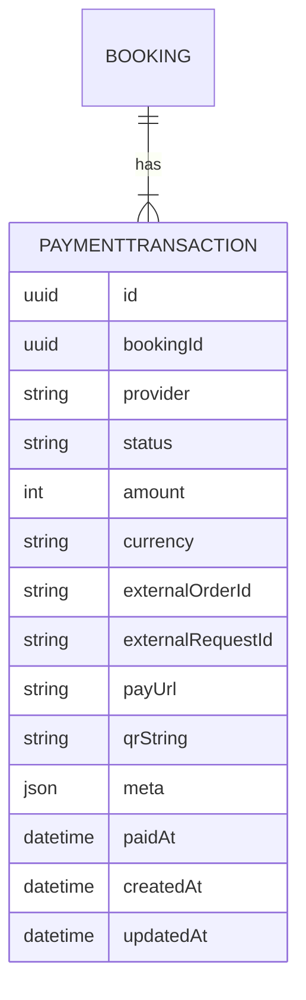
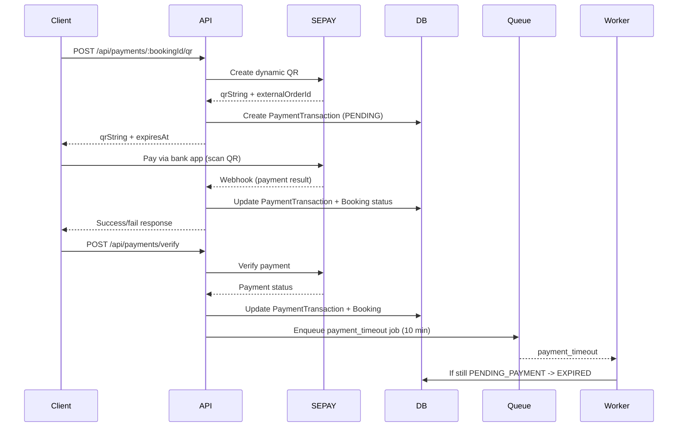

# Technical Design Document: Payment Flow (SePay QR Dynamic, In-App)

## 1. Overview

This feature adds a payment flow after booking creation using SePay QR dynamic in-app. Users create a booking and then click "Pay" to generate a QR code that is shown in the app. Payment confirmation is handled via SePay webhook plus client verify endpoint (server-side verification). Unpaid bookings expire after 10 minutes via a dedicated payment-timeout worker. The architecture is provider-plugin to support future gateways.

## 2. Requirements

### 2.1 Functional Requirements

- As a customer, I can initiate payment for a `PENDING_PAYMENT` booking only after clicking "Pay".
- The system generates a SePay dynamic QR for the booking and returns QR data for in-app display.
- The system confirms payment via SePay webhook and also supports client verify.
- The system updates `PaymentTransaction` and `Booking` status upon payment success/failure.
- The system expires unpaid bookings after 10 minutes and marks related payment attempts as `EXPIRED`.
- The system logs each step of the payment flow with correlation IDs to pinpoint errors.

### 2.2 Non-Functional Requirements

- p95 QR creation latency should remain under 300ms for the API call.
- Webhook endpoint must validate signature and reject invalid payloads.
- Idempotency must prevent duplicate webhook updates.
- Logs must exclude PII and secrets.
- The design must be extensible to additional gateways (other QR/payment providers).

## 3. Technical Design

### 3.1 Data Model Changes

Add `PaymentTransaction` and link 1–n to `Booking` (one booking can have multiple attempts).



Notes:
- Unique index `(provider, externalOrderId)`.
- Index `(status, createdAt)` for monitoring and cleanup.
- Invariant: at most one `PENDING` attempt per booking.

### 3.2 API Changes

**1) Create QR payment**
- `POST /api/payments/:bookingId/qr`
- Middleware: `authenticate -> requireRole(CUSTOMER) -> validate(createQrValidator)`
- Controller: `createPaymentQrHandler`
- Service: `paymentService.createQr`
- Response example:
```json
{
  "success": true,
  "data": {
    "paymentTransactionId": "uuid",
    "qrString": "000201010212...",
    "expiresAt": "2026-03-09T10:00:00.000Z"
  }
}
```

**2) Webhook (SePay)**
- `POST /api/payments/webhooks/sepay`
- Middleware: signature validation
- Controller: `handleSepayWebhook`
- Service: `paymentService.handleWebhook`
- Response: `200 OK` on accepted, `401` on invalid signature

**3) Client verify**
- `POST /api/payments/verify`
- Middleware: `authenticate -> requireRole(CUSTOMER)`
- Controller: `verifyPaymentHandler`
- Service: `paymentService.verify`

### 3.3 UI Changes

- No backend UI changes required.
- Frontend should show Pay button only for `PENDING_PAYMENT` and display QR for payment.

### 3.4 Logic Flow



### 3.5 Dependencies

- `bullmq` for payment-timeout queue
- SePay API integration (QR + webhook + verify)
- `zod` for validation
- `pino` for structured logging

New env vars:
- `PAYMENT_TIMEOUT_MINUTES`
- `SEPAY_MERCHANT_ID`
- `SEPAY_SECRET_KEY`
- `SEPAY_API_BASE_URL`
- `SEPAY_WEBHOOK_SECRET` (if required)
- `SEPAY_QR_EXPIRE_MINUTES` (if required)
- `SEPAY_IPN_API_KEY`
- `SEPAY_BANK_ACCOUNT`
- `SEPAY_BANK_NAME`
- `SEPAY_API_TOKEN` (if using verify API)

### 3.6 Security Considerations

- Validate webhook signature; reject invalid payloads with `401`.
- Use HTTPS-only webhook endpoints in production.
- Enforce JWT auth for QR creation and verify endpoints.
- Avoid logging secrets, signatures, or PII.

### 3.7 Performance and Reliability Considerations

- QR creation should be fast; use async HTTP calls to SePay.
- Webhook handling must be idempotent.
- Payment-timeout worker should retry on transient DB errors.
- Ensure queue and Redis capacity for timeout jobs.

### 3.8 Observability and Operations

- Structured logs with correlation ID (`bookingId` or `paymentFlowId`).
- Event logs: `payment_qr_created`, `payment_webhook_received`, `payment_verified`, `payment_succeeded`, `payment_expired`, `payment_failed`.
- Error logs: `payment_provider_error`, `payment_signature_invalid`, `payment_state_conflict`.
- Metrics (counters/histograms) for payment success/failure and latency.

## 4. Testing Plan

- Unit tests:
  - Provider registry selects correct adapter.
  - PaymentService state transitions.
- Integration tests:
  - Create QR for `PENDING_PAYMENT`.
  - Webhook updates `Booking` to `PAID`.
  - Timeout worker expires unpaid booking.
- Contract tests:
  - Validate OpenAPI schemas for payment endpoints.

## 5. Open Questions

- None for Phase 1 (SePay QR dynamic).

## 6. Alternatives Considered

- **Single worker for booking + payment timeouts**: rejected in favor of a dedicated payment worker for clearer responsibility and future scalability.
- **Auto-create QR at booking creation**: rejected to reduce unused sessions and improve UX control.
